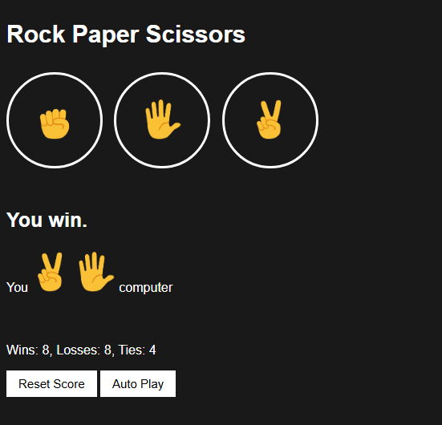

# JavaScript Rock Paper Scissors Game

A Simple JavaScript interactive Rock Paper Scissors game built with vanilla JavaScript. The game allows players to use buttons or keyboard controls, includes an auto-play mode, and saves the score using localStorage.

##  Features
- Play using buttons or keyboard (R, P, S)
- Auto-play mode
- Random computer opponent
- Score tracking (wins, losses, ties)
- Persistent score using localStorage
- Clean and simple user interface

##  Built With
- HTML5
- CSS3
- JavaScript (Vanilla)

##  What I Learned
- DOM manipulation
- Event listeners
- Keyboard events
- Working with functions and conditionals
- Using setInterval for automation
- Saving and retrieving data using localStorage

##  Screenshot

